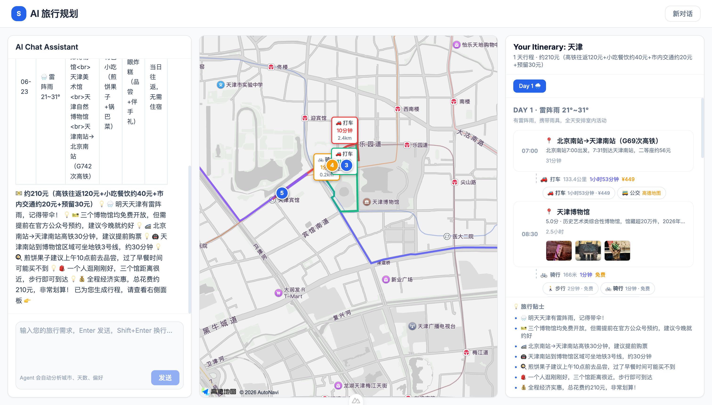

# 🗺️ Stitch AI — 智能旅行规划助手

<p align="center">
  
</p>

<p align="center">
  <strong>用自然语言描述需求，AI 秒级生成完整旅行计划。</strong><br/>
  集成美团真实酒旅数据 · 高德地图多模式路线规划 · 实时天气查询
</p>

<p align="center">
  
  
  
  
</p>

---

## 📸 预览

<p align="center">
  
</p>

---

## 🚀 快速开始

```bash
# 1. 后端 (端口 3333)
cd server
cp .env.example .env   # 填入 DEEPSEEK_API_KEY + AMAP_API_KEY
npm install && npm run dev

# 2. 前端 (端口 5173)
cd client
npm install && npm run dev
```

打开 <http://localhost:5173> 即可使用。

---

## 🧠 核心能力

| 层级 | 技术 |
|------|------|
| **Agent 引擎** | ReAct 循环 · Function Calling · 结构化 JSON 输出 |
| **LLM** | DeepSeek / OpenAI 兼容 · 滑动窗口短期记忆 |
| **数据源** | 美团酒旅 · 高德天气 · 高德地图 |
| **路线规划** | 驾车/步行/骑行/公交多模式 · 自动推荐最优方式 |
| **前端** | Nuxt 3 · Tailwind CSS · 三列布局 · SSE 流式对话 |

## 🏗️ 架构

```
┌──────────────────────────┐      SSE       ┌──────────────────────────┐
│   Server (Express)        │ ──────────────→ │   Client (Nuxt 3)         │
│                          │                  │                          │
│  Agent Engine            │                  │  plan.vue                │
│  ├─ ReAct Loop            │                  │  ├─ 聊天天 (2/7)          │
│  ├─ Tool Registry         │                  │  ├─ 地图 (3/7)           │
│  ├─ Prompt Engineering    │                  │  └─ 时间线 (2/7)         │
│  └─ Short-term Memory     │                  │                          │
└──────────┬───────────────┘                  └──────────────────────────┘
           │
           ▼
  ┌─────────────────┐
  │  External APIs   │
  │  • Amap Weather   │
  │  • Amap Directions│
  │  • Meituan Travel │
  │  • DeepSeek LLM   │
  └─────────────────┘
```

## 📁 项目结构

| 目录 | 说明 | 详细文档 |
|------|------|---------|
| [`server/`](server/) | Node.js 后端 · Express · Agent 引擎 | [server/README.md](server/README.md) |
| [`client/`](client/) | Nuxt 3 前端 · 地图 · 时间线 | [client/README.md](client/README.md) |
| `screenshots/` | 页面截图 | - |

## 🔄 Agent 流程

```
用户输入 → Step 0 需求分析 → Step 1 天气查询 → Step 2 美团搜索 → Step 3 生成 TripPlan JSON
```

SSE 事件: `start` → `thought` → `action` → `observation` → `plan_partial` → `plan_complete`

---

## 📄 License

MIT © 2026


# travel-agent-client

AI 旅行规划前端。基于 Nuxt 3 + Vue 3，提供实时聊天式旅行规划体验，集成高德地图互动地图和多模式路线规划。

## 技术栈

- **Framework**: Nuxt 3 (Vue 3 + Vite)
- **State**: Pinia
- **CSS**: Tailwind CSS + 自定义主题
- **Map**: 高德地图 JS API v2.0（client-only 动态加载）
- **Routes**: 高德 Web 服务 API v5（驾车/步行/骑行/公交）
- **TypeScript**: Strict mode

## 快速开始

```bash
npm install
npm run dev            # :5173，API 代理到 localhost:3333
```

## 环境变量

| 变量 | 说明 |
|------|------|
| `NUXT_PUBLIC_AMAP_KEY` | 高德 JS API Key（地图展示 + POI 搜索） |
| `NUXT_PUBLIC_AMAP_SECURITY_CODE` | 高德安全密钥（JS API v2.0 必需） |
| `NUXT_PUBLIC_AMAP_WS_KEY` | 高德 Web 服务 Key（路线规划 REST API） |
| `NUXT_PUBLIC_API_BASE` | 生产环境 API 地址。开发时留空，使用 Vite proxy |

## 页面

| 路由 | 页面 | 说明 |
|------|------|------|
| `/` | Landing Page | 产品展示落地页 |
| `/plan` | Trip Planner | 三列布局：聊天（2/7）+ 地图（3/7）+ 时间线（2/7） |

## 核心交互流程

```
初始状态：全屏聊天界面
  ↓ 用户输入自然语言需求
  ↓ SSE 实时流式回复（DeepSeek 风格思考面板可展开）
  ↓ Agent 信息不足 → 追问 → 用户补充 → 继续
  ↓ Agent 生成 TripPlan JSON
  ↓ 前端解析 → geocode 无坐标活动 → 多模式路线规划
  ├─ 地图区域：编号标记 + 彩色路线 + 时间标签
  └─ 时间线区域：DayCard + RouteCard（交通方式切换）
```

## 组件

| 组件 | 说明 |
|------|------|
| `TravelMap.client.vue` | 高德地图，geocode 地点 → 多模式路线规划 → 标记 + 彩色路线 |
| `TimelinePanel.vue` | 日期标签切换 + 行程概览 + 预算/贴士 |
| `DayCard.vue` | 单日卡片：天气条 + 活动时间线 + RouteCard + 酒店信息 |
| `ActivityItem.vue` | 活动项：时间、类型图标、名称、备注、图片缩略图 |
| `RouteCard.vue` | 路段卡片：多模式切换（步行/骑行/驾车/公交）、自动推荐、费用/时间 |
| `ImagePreview.vue` | 全屏图片预览，支持键盘导航（← → Esc） |

## Composables

| Composable | 说明 |
|------------|------|
| `usePlanChat` | 聊天核心：SSE、Markdown 渲染、思考面板、快捷提示 |
| `useRoutes` | 多模式路线规划（高德 REST API v5）+ 自动推荐引擎 |
| `useSSE` | SSE 流式连接，支持主动打断 |
| `useApiBase` | 读取 runtimeConfig 中的 API 地址 |

## Stores (Pinia)

| Store | 核心状态 | 说明 |
|-------|---------|------|
| `trip` | `plan`, `activeDay`, `routesByDay`, `focusActivity` | 行程计划、当前激活日、多模式路线数据 |

## 路线规划引擎

前端根据 TripPlan 坐标自动计算路线：

| 模式 | 高德 API | 自动推荐条件 |
|------|---------|------------|
| 🚶 步行 | `/v5/direction/walking` | < 2km · 免费 |
| 🚲 骑行 | `/v5/direction/bicycling` | 2-8km · 经济/适中预算 |
| 🚗 驾车 | `/v5/direction/driving` | 任意距离 · 适中/奢华预算 |
| 🚌 公交 | 唤起高德地图 App | 不调 API，跳转高德导航 |

- 时间/费用全部使用 API 返回真实数据
- 用户可在 RouteCard 中切换交通方式，地图路线实时更新

## 项目结构

```
pages/
  index.vue                 # 落地页
  plan.vue                  # 规划页（聊天 + 地图 + 时间线）
components/
  TravelMap.client.vue      # 高德地图（geocode + 路线 + 标记）
  TimelinePanel.vue         # 时间线面板
  DayCard.vue               # 单日卡片
  ActivityItem.vue          # 活动条目
  RouteCard.vue             # 路段卡片（交通方式切换）
  ImagePreview.vue          # 图片预览
composables/
  usePlanChat.ts            # 聊天逻辑
  useRoutes.ts              # 路线规划引擎
  useSSE.ts                 # SSE 连接
  useApiBase.ts             # API 地址
stores/
  trip.ts                   # 行程状态
types/
  index.ts                  # 类型定义 + 预设常量
```

## 脚本

| 命令 | 说明 |
|------|------|
| `npm run dev` | 开发模式 (:5173) |
| `npm run build` | 生产构建 |
| `npm run generate` | 静态生成 |
| `npm run preview` | 预览生产构建 |

---

> 📝 本文档随功能变更同步维护。最后更新：2026-06-22
